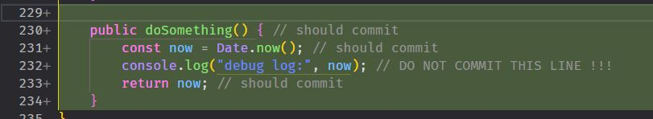
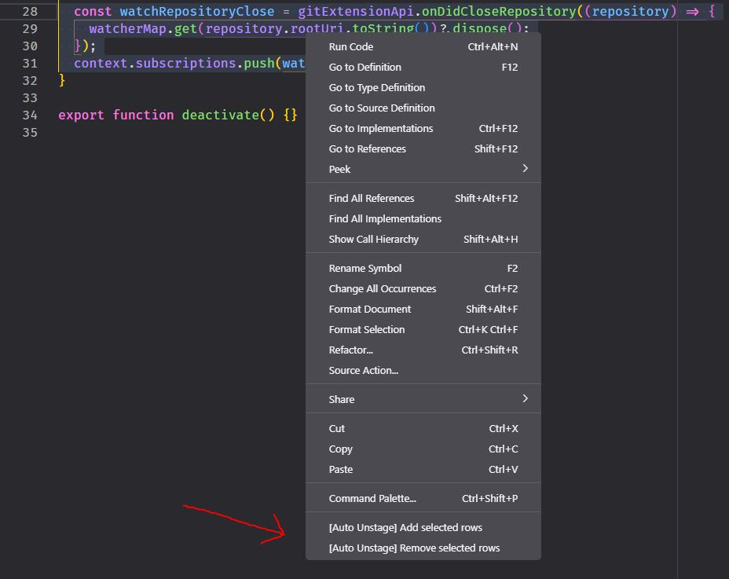
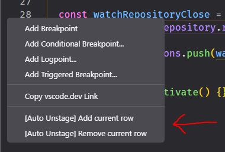
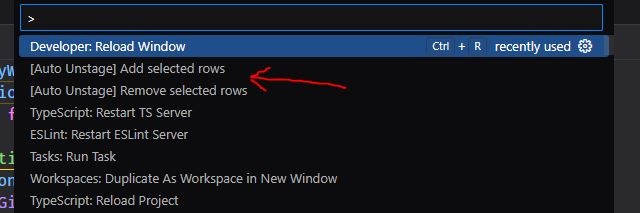
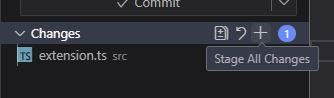
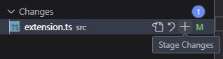
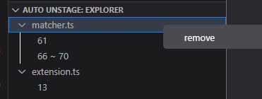

# Auto Unstage

## Motivation

There are some debug codes I don't want to commit.  
So I develop a simple extension to automatically remove them from git staging area.

## Usage

### 1. Select rows and mark them

editor context menu:  

or gutter context menu:  

or commands:  

### 2. Click staging buttons

Notes: run command `git add .` will not trigger, only support staging buttons.

### 3. Manage marked rows in tree view

